# 第01课 项目介绍与环境搭建

## 一. 项目介绍

使用 python + selenium 实现自动去图片资源网站搜索并下载图片

（其实就是爬虫）

https://pixabay.com/


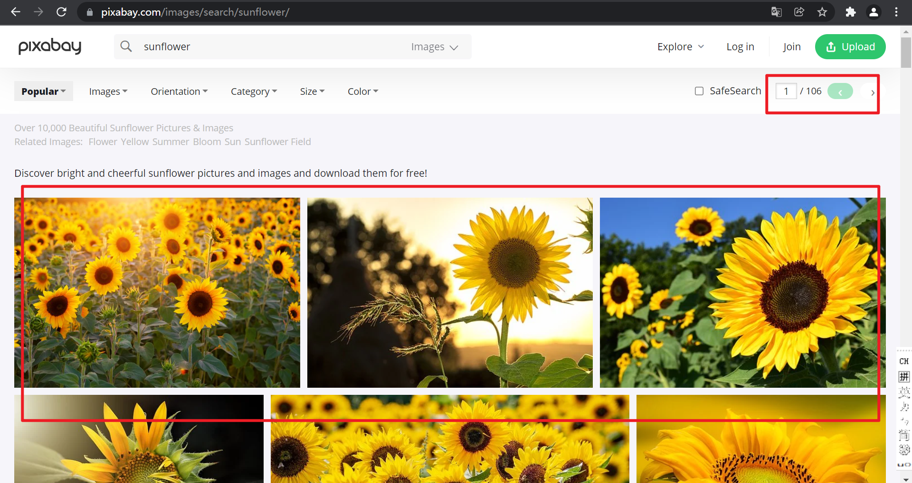

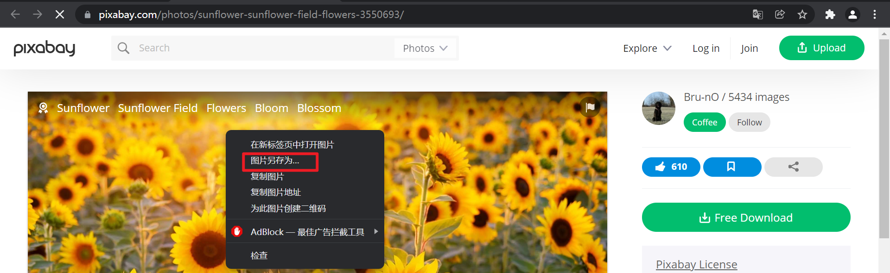

## 二. 环境搭建

### 2.1 操作系统

Windows 11

### 2.2 安装 Python

Python 3.10.1

https://www.python.org/downloads/release/python-3101/

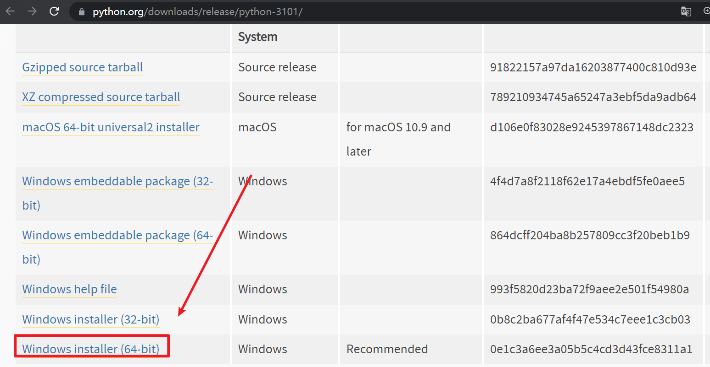

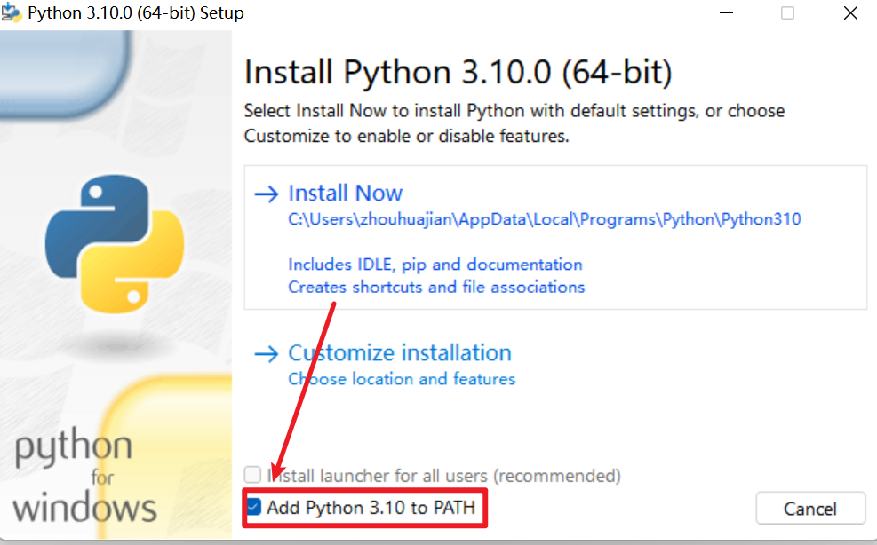

> 注意勾选一下把Python加到环境变量

### 2.3 安装 PyCharm

https://www.jetbrains.com/pycharm/download

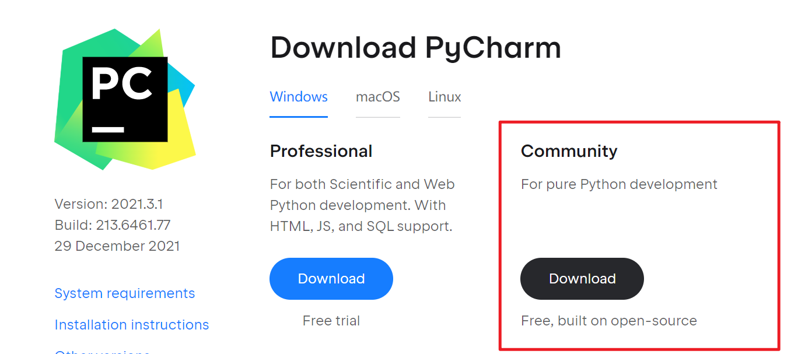

### 2.4 创建项目

2.4.1 桌面创建项目目录

python-selenium-web-image-auto-search-and-save

2.4.2 打开项目  

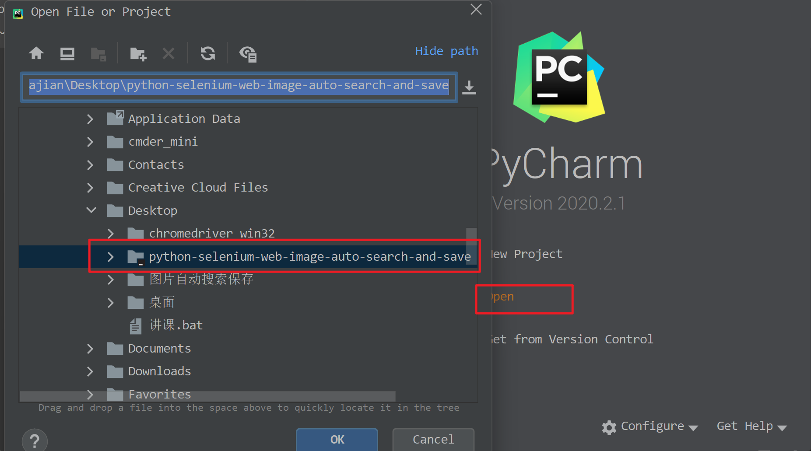

### 2.5 安装 Selenium

2.5.1 使用 pip 安装

`pip install selenium`

版本为selenium-4.1.0

> 备注：打开终端快捷键 Alt + F12

2.5.2 使用 requirements.txt 统一管理项目依赖

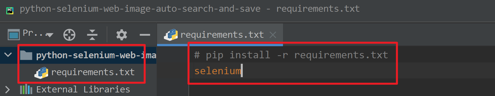

```
# pip install -r requirements.txt
selenium
```

### 2.6 安装Chrome浏览器

https://www.google.cn/chrome/index.html

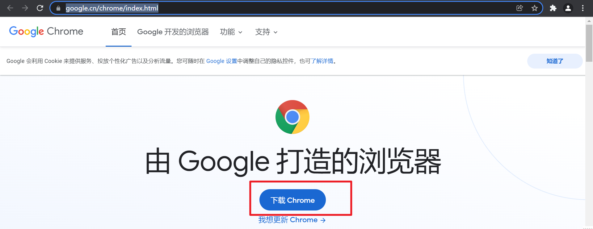

### 2.7 下载浏览器驱动 chromedriver

2.7.1 下载对应Chrome版本的驱动

https://www.selenium.dev/documentation/webdriver/getting_started/install_drivers/

https://chromedriver.storage.googleapis.com/index.html

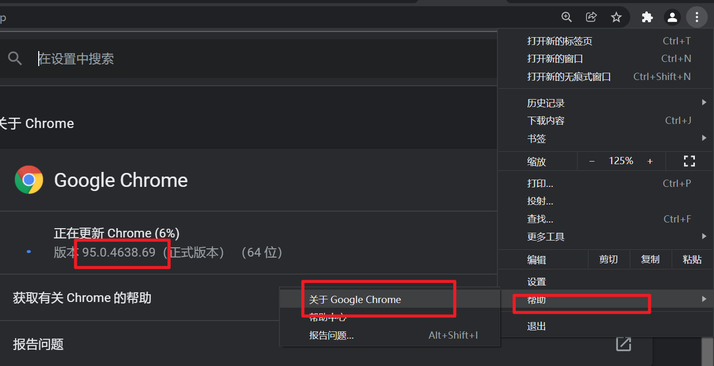

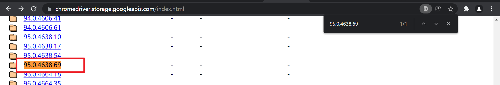

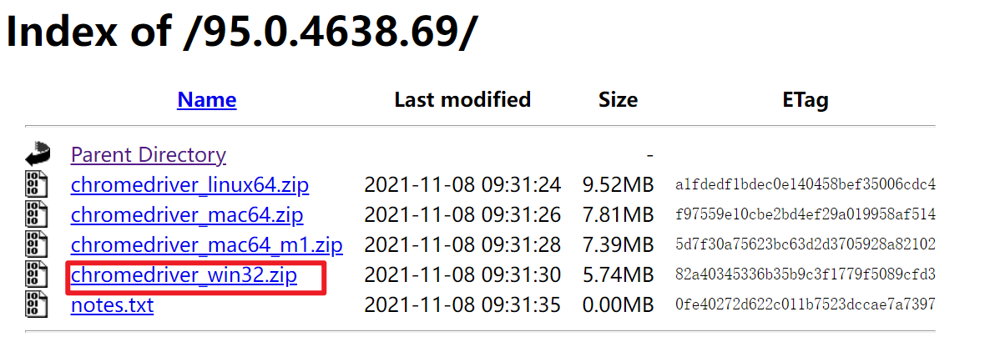

> 备注：chromedriver_win32.zip 64位 32位 windows 都能用

2.7.2 解压并复制chromedriver.exe到项目目录

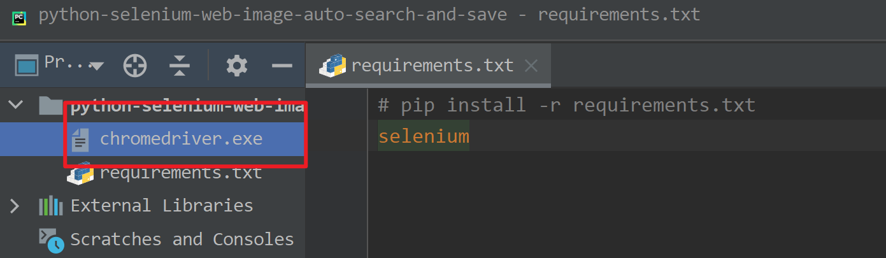

> 备注：chromedriver放哪里都可以，放项目里面为了方便，缺点是不利于重复使用

### 2.8 创建main.py并调试

```python
"""
图片自动搜索保存

@author  : zhouhuajian
@version : v1.0
"""

if __name__ == '__main__':
    print(123)
```

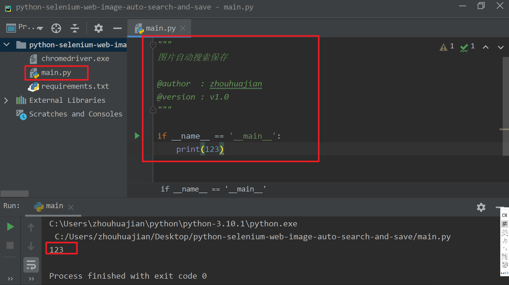

> 备注：运行脚本快捷键 Ctrl + Alt + F10
