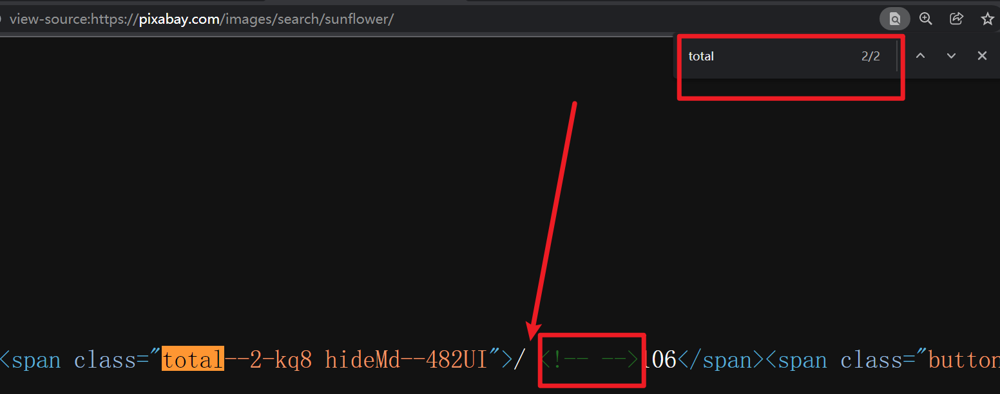

# 第04课 遍历所有图片列表页面

## 一. 分析图片列表页面规律

https://pixabay.com/

总页面数 106

第一页 https://pixabay.com/images/search/sunflower/ 

第二页 https://pixabay.com/images/search/sunflower/?pagi=2&

第三页 https://pixabay.com/images/search/sunflower/?pagi=3&

...

第N页 https://pixabay.com/images/search/sunflower/?pagi=N& 

> 备注：如果大家对这个网站熟悉了，上节课的图片自动搜索可以使用访问 https://pixabay.com/images/search/{关键字}/ 来实现。


## 二. 获取总页面数

### 2.1 定位总页面数的HTML元素

页面总数，右键，检查

span[class^=total] 能找到两个，头部一个，尾部一个，取第一个即可

> 备注：
>
> 1. 不建议使用total--2-kq8完整的类名来定位元素，后面的-kq8，用来反爬虫的，隔一段时间会修改；
> 2. span里面的文字以双引号引起来，说明有其他元素存在，看源码能看到，有<!-- -->，获取span文本内容的时候，html标签会被过滤掉，但/和空格需要手动去掉；
>
> 3. CSS选择器的属性选择器 [attr^=value] 表示有 attr 属性，且属性值是 value 开头；
>
> ​          https://developer.mozilla.org/zh-CN/docs/Web/CSS/Attribute_selectors




### 2.2 写代码获取总页面数

```python
    def run(self):
        """开始运行"""
        print("========= 开始 =========")
        # ...
        # 遍历所有图片列表页面
        self._iter_all_page()
        print("========= 结束 =========")
    def _iter_all_page(self):
        """遍历所有图片列表页面"""
        # 获取页面总数
        elem = self.driver.find_element_by_css_selector("span[class^=total]")
        print(elem.text)
        page_total = int(elem.text.strip("/ "))
        print(f"总页数：{page_total}")
```


> 备注：
>
> 1. find_element_by_css_selector 会返回第一个找到的元素；
>
> 2. 获取的总数是字符串类型，需要转成int类型；
>
> 3. selenium元素对象的text属性，获取文本规则比较多，建议调试，
>
>    它会获取元素里面的文本和所有行内元素的文本，
>
>    并且行内元素的标签会被去掉，
>
>    它不会获取块级元素的文本，块级元素会整体被去掉。

## 三. 遍历所有页面

```python
    def _iter_all_page(self):
        """遍历所有图片列表页面"""
        # 获取页面总数
        # ...
        # 获取遍历页面的基础url，也就是第一页的URL
        base_url = self.driver.current_url
        # 遍历所有页面
        for page_num in range(1, page_total + 1):
            print(f"正在访问第{page_num}页")
            if page_num > 1:
                url = f"{base_url}?pagi={page_num}&"
                self.driver.get(url)
```

> 备注：搜索后的页面就是第一页，第一页不需要重新访问。

所有代码

```python
"""
图片资源自动搜索下载

@author  : zhouhuajian
@version : v1.0
"""
from os.path import dirname

from selenium import webdriver
from selenium.webdriver.common.keys import Keys


class ImageAutoSearchAndSave:
    """图片自动搜索保存"""

    def __init__(self, keyword):
        """初始化"""
        self.driver = webdriver.Chrome(executable_path=dirname(__file__) + '/chromedriver.exe')
        self.keyword = keyword

    def run(self):
        """开始运行"""
        print("========= 开始 =========")
        # 访问首页
        self.driver.get("https://pixabay.com/")
        # 搜索图片
        self._search_image()
        # 遍历所有图片列表页面
        self._iter_all_page()
        print("========= 结束 =========")

    def _search_image(self):
        """搜索图片"""
        elem = self.driver.find_element_by_css_selector("input[name]")
        elem.send_keys(self.keyword + Keys.ENTER)

    def _iter_all_page(self):
        """遍历所有图片列表页面"""
        # 获取页面总数
        elem = self.driver.find_element_by_css_selector("span[class^=total]")
        page_total = int(elem.text.strip("/ "))
        print(f"总页面数：{page_total}")
        # 遍历所有页面
        base_url = self.driver.current_url
        for page_num in range(1, page_total + 1):
            print(f"正在访问第{page_num}页")
            if page_num > 1:
                self.driver.get(f"{base_url}?pagi={page_num}&")


if __name__ == '__main__':
    keyword = "sunflower"
    ImageAutoSearchAndSave(keyword).run()
```


