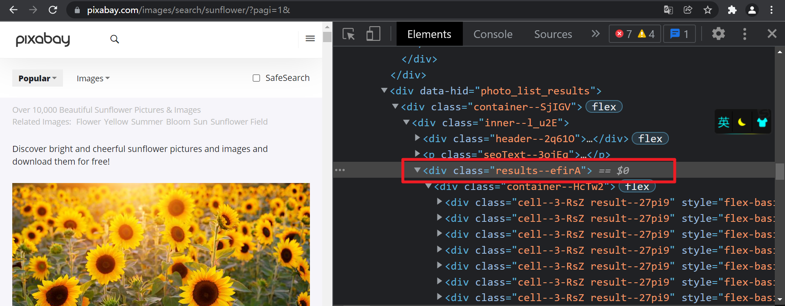
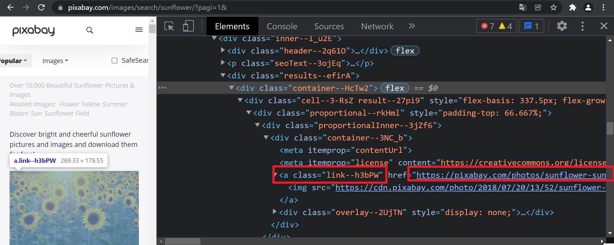
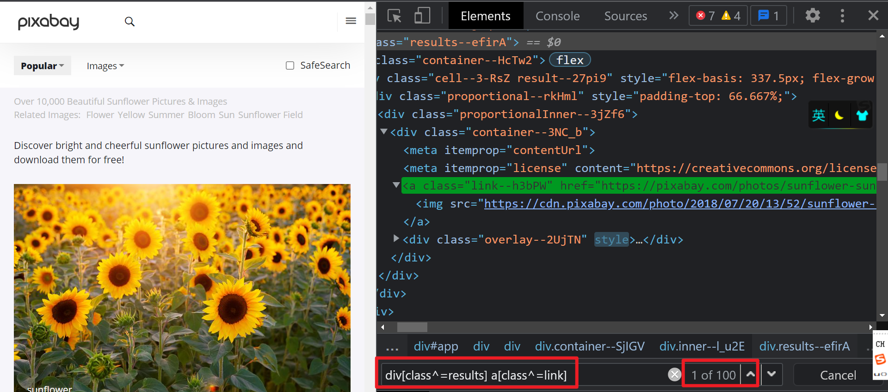
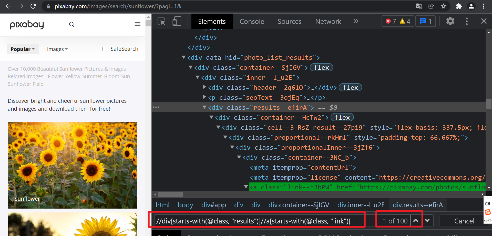
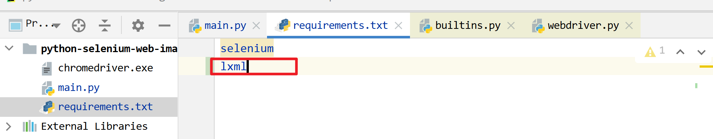
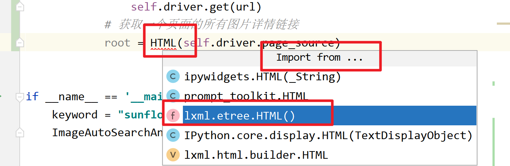
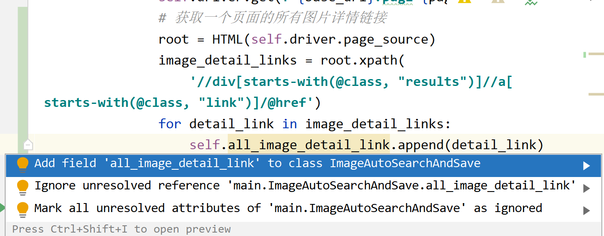
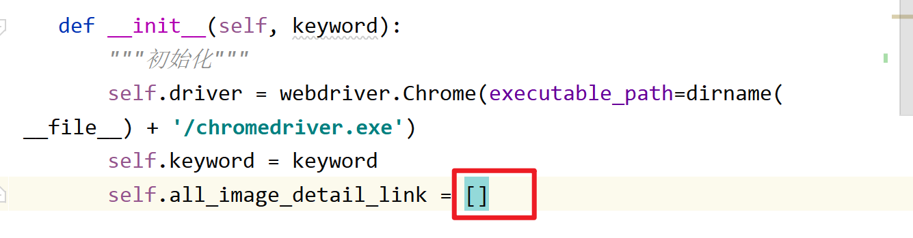

# 第05课 获取所有图片详情页链接

## 一. 获取图片详情页链接

### 1.1 定位所有图片详情链接

定位图片列表所有的a元素





div[class^=results] a[class^=link] 

//div[starts-with(@class, "results")]//a[starts-with(@class, "link")]

每页共100张图片，需要获取的是href属性的值





### 1.2 写代码批量获取图片详情链接

1.2.1 安装lxml库 

requirements.txt 增加 lxml 库，然后终端执行 `pip install -r requirements.txt`

> 备注：使用这个库的原因，是因为这个库可以非常方便地批量获取元素的属性值



1.2.2 使用 lxml.etree.HTML() 函数，传html代码

它会解析html文档，生成元素树，并返回根元素，或者叫根节点

```python
        # 遍历所有页面
        for page_num in range(1, page_total + 1):
            # ...
            # 获取一个页面的所有图片详情链接
            root = HTML(self.driver.page_source)
```



1.2.3 调用根节点的 xpath() 方法，查找所有符合条件的a元素，

并返回所有找到的a元素的 href 属性值，以列表的方式返回

```python
        # 遍历所有页面
        for page_num in range(1, page_total + 1):
            # ...
            # 获取一个页面的所有图片详情链接
            root = HTML(self.driver.page_source)
            image_detail_links = root.xpath('//div[starts-with(@class, "results")]//a[starts-with(@class, "link")]/@href')
            print(image_detail_links)
```

> 备注：lxml 方便之处，就是可以使用/@href这种语法，获取元素的属性值

## 二. 使用列表记录所有详情页链接

使用all_image_detail_link列表来记录所有详情链接





所有代码

```python
"""
图片资源自动搜索下载

@author  : zhouhuajian
@version : v1.0
"""
from os.path import dirname

from lxml.etree import HTML
from selenium import webdriver
from selenium.webdriver.common.keys import Keys


class ImageAutoSearchAndSave:
    """图片自动搜索保存"""

    def __init__(self, keyword):
        """初始化"""
        self.driver = webdriver.Chrome(executable_path=dirname(__file__) + '/chromedriver.exe')
        self.keyword = keyword
        self.all_image_detail_link = []

    def run(self):
        """开始运行"""
        print("========= 开始 =========")
        # 访问首页
        self.driver.get("https://pixabay.com/")
        # 搜索图片
        self._search_image()
        # 遍历所有图片列表页面
        self._iter_all_page()
        print("========= 结束 =========")

    def _search_image(self):
        """搜索图片"""
        elem = self.driver.find_element_by_css_selector("input[name]")
        elem.send_keys(self.keyword + Keys.ENTER)

    def _iter_all_page(self):
        """遍历所有图片列表页面"""
        # 获取页面总数
        elem = self.driver.find_element_by_css_selector("span[class^=total]")
        page_total = int(elem.text.strip("/ "))
        print(f"总页面数：{page_total}")
        # 遍历所有页面
        base_url = self.driver.current_url
        for page_num in range(1, page_total + 1):
            print(f"正在访问第{page_num}页")
            if page_num > 1:
                self.driver.get(f"{base_url}?pagi={page_num}&")
            # 获取一个页面的所有图片详情链接
            root = HTML(self.driver.page_source)
            image_detail_links = root.xpath(
                '//div[starts-with(@class, "results")]//a[starts-with(@class, "link")]/@href')
            # 遍历当前列表页面的所有图片详情链接
            for detail_link in image_detail_links:
                self.all_image_detail_link.append(detail_link)
       

if __name__ == '__main__':
    keyword = "sunflower"
    ImageAutoSearchAndSave(keyword).run()
```

