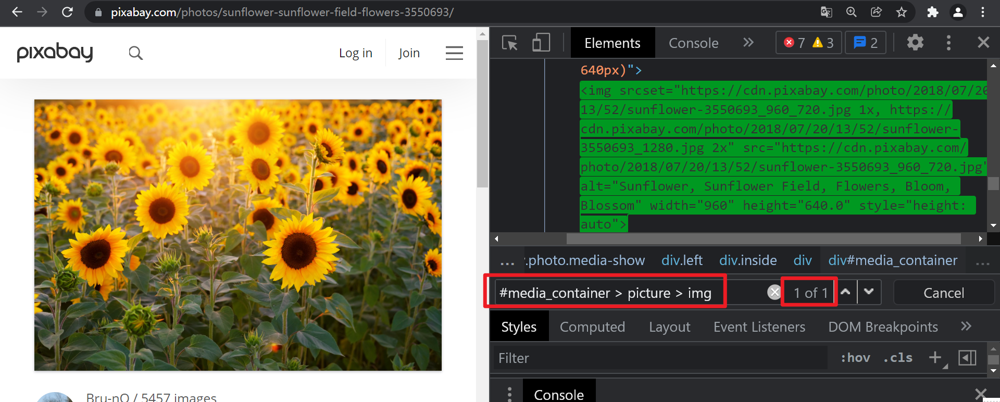

# 第07课 访问图片详情、获取图片下载链接

## 一. 访问图片详情

```python
    def run(self):
        """开始运行"""
        # ...
        # 访问图片详情
        self._visit_image_detail()
    def _visit_image_detail(self):
        """访问图片详情"""
        for image_detail_link in self.all_image_detail_link:
            self.driver.get(image_detail_link)
```

## 二. 获取图片下载链接

2.1 获取图片下载链接

#media_container > picture > img



```python
    def _visit_image_detail(self):
        """访问图片详情"""
        for image_detail_link in self.all_image_detail_link:
            self.driver.get(image_detail_link)
            # 获取图片下载链接
            elem = self.driver.find_element_by_css_selector("#media_container > picture > img")
            download_link = elem.get_attribute("src")
            print(f"下载链接：{download_link}")
```

2.2 使用列表保存所有下载链接

```python
    def __init__(self, keyword, limit=0):
        """初始化"""
        # ...
        self.all_download_link = []
    def _visit_image_detail(self):
        """访问图片详情"""
        for image_detail_link in self.all_image_detail_link:
            # ...
            self.all_download_link.append(download_link)
```

## 三. 简单清理

后面下载图片不需要self.driver、浏览器和self.all_image_detail_link

关闭driver、关闭浏览器、删除self.all_image_detail_link

释放资源，释放内存

```python
    def run(self):
        """开始运行"""
        # ...
        # 释放资源、释放内存
        self.driver.close()
        del self.all_image_detail_link
```

最终代码

```python
"""
图片资源自动搜索下载

@author  : zhouhuajian
@version : v1.0
"""
from os.path import dirname

from lxml.etree import HTML
from selenium import webdriver
from selenium.webdriver.common.keys import Keys


class ImageAutoSearchAndSave:
    """图片自动搜索保存"""

    def __init__(self, keyword, limit=0):
        """初始化"""
        self.driver = webdriver.Chrome(executable_path=dirname(__file__) + '/chromedriver.exe')
        self.keyword = keyword
        self.limit = limit  # 0表示没有限制
        self.count = 0  # 用来计数
        self.all_detail_link = []
        self.all_download_link = []

    def run(self):
        """开始运行"""
        print("========= 开始 =========")
        # 访问首页
        self.driver.get("https://pixabay.com/")
        # 搜索图片
        self._search_image()
        # 遍历所有页面
        self._iter_all_page()
        # 访问图片详情页
        self._visit_image_detail()
        # 释放内存、释放资源
        self.driver.close()
        del self.all_detail_link
        print("========= 结束 =========")

    def _search_image(self):
        """搜索图片"""
        elem = self.driver.find_element_by_css_selector("input[name]")
        elem.send_keys(self.keyword + Keys.ENTER)

    def _iter_all_page(self):
        """遍历所有页面"""
        # 获取总页面
        elem = self.driver.find_element_by_css_selector("span[class^=total]")
        page_total = int(elem.text.strip("/ "))
        print(f"总页面数：{page_total}")
        # 遍历所有页面
        base_url = self.driver.current_url
        for page_num in range(1, page_total + 1):
            print(f"正在访问第{page_num}页")
            if page_num > 1:
                self.driver.get(f"{base_url}?pagi={page_num}&")
            #  href属性
            root = HTML(self.driver.page_source)
            detail_links = root.xpath('//div[starts-with(@class, "results")]//a[starts-with(@class, "link")]/@href')
            # print(detail_links)
            is_reach_limit = False
            for detail_link in detail_links:
                self.all_detail_link.append(detail_link)
                self.count += 1
                if self.limit > 0 and self.count == self.limit:
                    is_reach_limit = True
                    print(f"已达到限制{self.limit}，结束收集图片详情页链接")
                    break
            if is_reach_limit:
                break
        print(f"共收集{len(self.all_detail_link)}个图片详情链接")

    def _visit_image_detail(self):
        """访问图片详情页"""
        for detail_link in self.all_detail_link:
            self.driver.get(detail_link)
            elem = self.driver.find_element_by_css_selector("#media_container > picture > img")
            download_link = elem.get_attribute("src")
            print(f"图片下载链接{download_link}")
            self.all_download_link.append(download_link)


if __name__ == '__main__':
    keyword = "sunflower"
    limit = 2
    ImageAutoSearchAndSave(keyword, limit).run()
```

