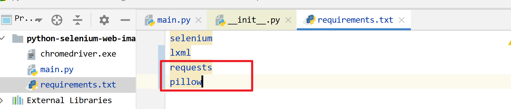
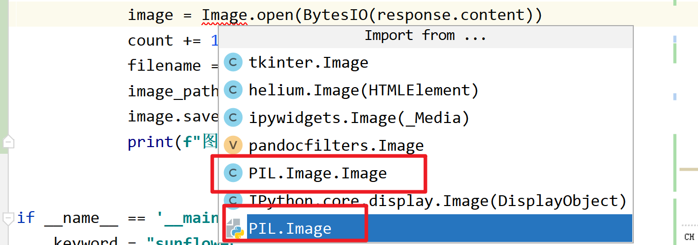

# 第08课 下载图片

## 一. 安装requests和pillow库

下载图片需要用到requests库，保存图片需要用到pillow库

`pip install -r requirements.txt`



## 二. 下载图片

2.1 创建图片存放目录

```python
    def run(self):
        """开始运行"""
        # ...
        # 下载所有图片
        self._download_all_image()
    def _download_all_image(self):
        """下载所有图片"""
        download_dir = f"{dirname(__file__)}/download/{strftime('%Y%m%d-%H%M%S')}-{self.keyword}"
        makedirs(download_dir)
```

2.2 下载图片

```python
    def _download_all_image(self):
        """下载所有图片"""
        # ...
        # 下载所有图片
        count = 0
        for download_link in self.all_download_link:
            # 下载图片
            response = requests.get(download_link)
            # response.content是字节串 response.text是字符串
            # 保存图片
            image = Image.open(BytesIO(response.content))
            count += 1
            filename = f"{str(count).rjust(6, '0')}.png"
            image_path = f"{download_dir}/{filename}"
            image.save(image_path)
            print(f"图片已保存：{image_path}")
```

> 备注：
>
> 1. Image要使用PIL.Image模块，而不是PIL.Image.Image类，
>
> 因为open是PIL.Image模块的一个函数；
>
> 2. 代码的组织方式有很多，大家也可以，在访问图片详情的时候，直接下载图片。



最终代码

```python
"""
图片资源自动搜索下载

@author  : zhouhuajian
@version : v1.0
"""
from io import BytesIO
from os import makedirs
from os.path import dirname
from time import strftime

import requests
from PIL import Image
from lxml.etree import HTML
from selenium import webdriver
from selenium.webdriver.chrome.options import Options
from selenium.webdriver.common.keys import Keys


class ImageAutoSearchAndSave:
    """图片自动搜索保存"""

    def __init__(self, keyword, limit=0):
        """初始化"""
        # 页面加载策略的优化
        options = Options()
        options.page_load_strategy = "eager"
        self._driver = webdriver.Chrome(executable_path=dirname(__file__) + '/chromedriver.exe', options=options)
        self._keyword = keyword
        self._limit = limit  # 0表示没有限制
        self._count = 0  # 用来计数
        self._all_detail_link = []
        self._all_download_link = []

    def run(self):
        """开始运行"""
        print("========= 开始 =========")
        # 访问首页
        self._driver.get("https://pixabay.com/")
        # 搜索图片
        self._search_image()
        # 遍历所有页面
        self._iter_all_page()
        # 访问图片详情页
        self._visit_image_detail()
        # 释放内存、释放资源
        self._driver.close()
        del self._all_detail_link
        # 下载所有图片
        self._download_all_image()
        print("========= 结束 =========")

    def _search_image(self):
        """搜索图片"""
        elem = self._driver.find_element_by_css_selector("input[name]")
        elem.send_keys(self._keyword + Keys.ENTER)

    def _iter_all_page(self):
        """遍历所有页面"""
        # 获取总页面
        elem = self._driver.find_element_by_css_selector("span[class^=total]")
        page_total = int(elem.text.strip("/ "))
        print(f"总页面数：{page_total}")
        # 遍历所有页面
        base_url = self._driver.current_url
        for page_num in range(1, page_total + 1):
            print(f"正在访问第{page_num}页")
            if page_num > 1:
                self._driver.get(f"{base_url}?pagi={page_num}&")
            #  href属性
            root = HTML(self._driver.page_source)
            detail_links = root.xpath('//div[starts-with(@class, "results")]//a[starts-with(@class, "link")]/@href')
            # print(detail_links)
            is_reach_limit = False
            for detail_link in detail_links:
                self._all_detail_link.append(detail_link)
                self._count += 1
                if self._limit > 0 and self._count == self._limit:
                    is_reach_limit = True
                    print(f"已达到限制{self._limit}，结束收集图片详情页链接")
                    break
            if is_reach_limit:
                break
        print(f"共收集{len(self._all_detail_link)}个图片详情链接")

    def _visit_image_detail(self):
        """访问图片详情页"""
        for detail_link in self._all_detail_link:
            self._driver.get(detail_link)
            elem = self._driver.find_element_by_css_selector("#media_container > picture > img")
            download_link = elem.get_attribute("src")
            print(f"图片下载链接{download_link}")
            self._all_download_link.append(download_link)

    def _download_all_image(self):
        """下载所有图片"""
        download_dir = f"{dirname(__file__)}/download/{strftime('%Y%m%d-%H%M%S')}-{self._keyword}"
        makedirs(download_dir)
        # 下载所有图片
        count = 0
        for download_link in self._all_download_link:
            response = requests.get(download_link)
            count += 1
            # response.content 二进制内容  response.text 文本内容
            image = Image.open(BytesIO(response.content))
            # 000001.png 000002.png 000003.png
            filename = f"{str(count).rjust(6, '0')}.png"
            file_path = f"{download_dir}/{filename}"
            image.save(file_path)
            print(f"图片已保存：{file_path}")


if __name__ == '__main__':
    keyword = "sunflower"
    limit = 3
    ImageAutoSearchAndSave(keyword, limit).run()
```


